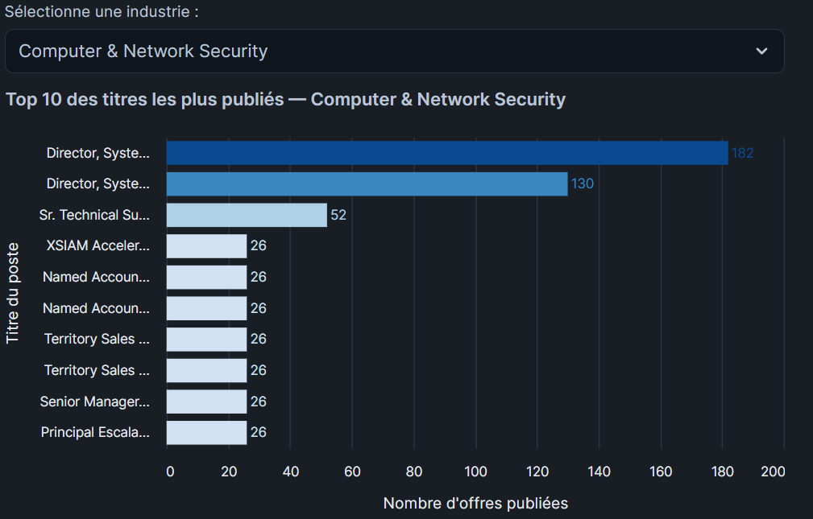
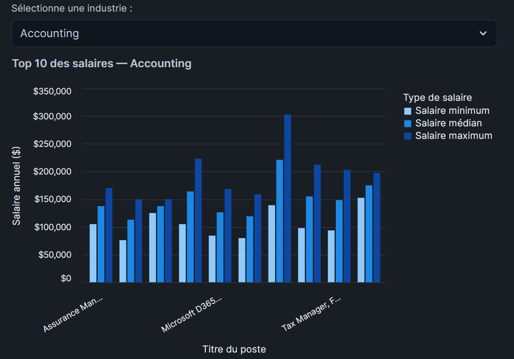
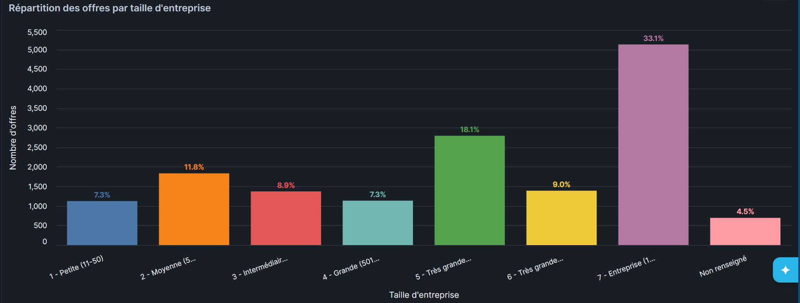
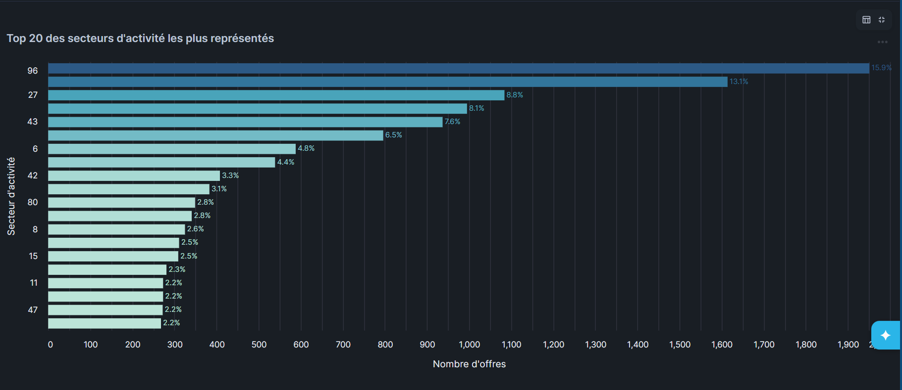
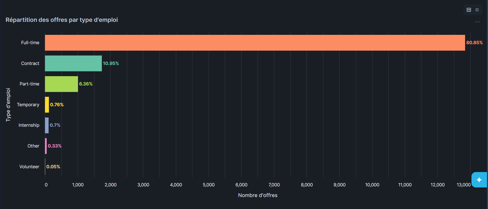
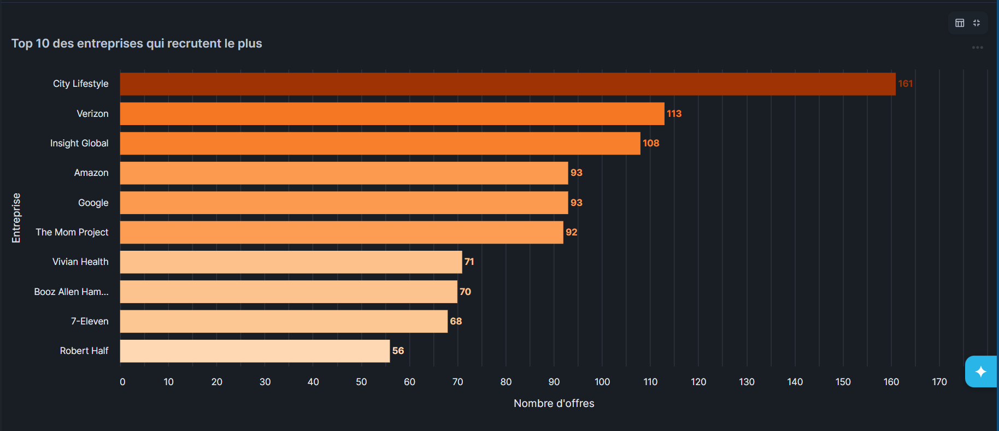
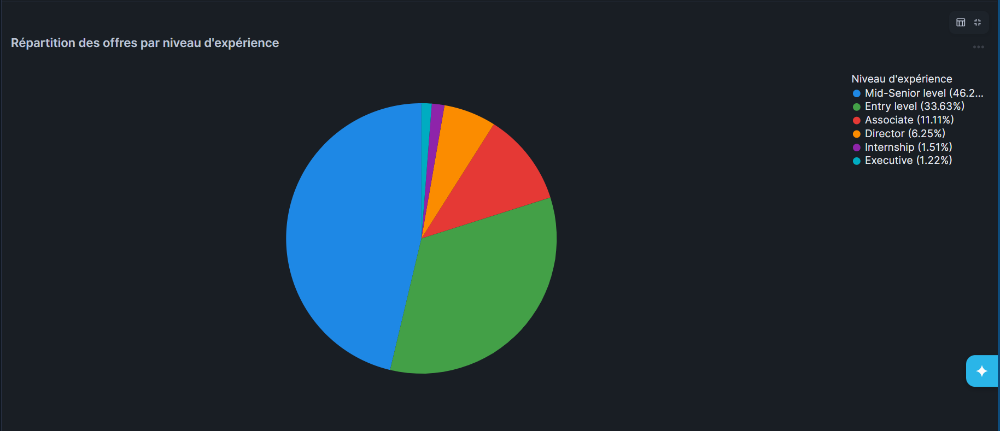
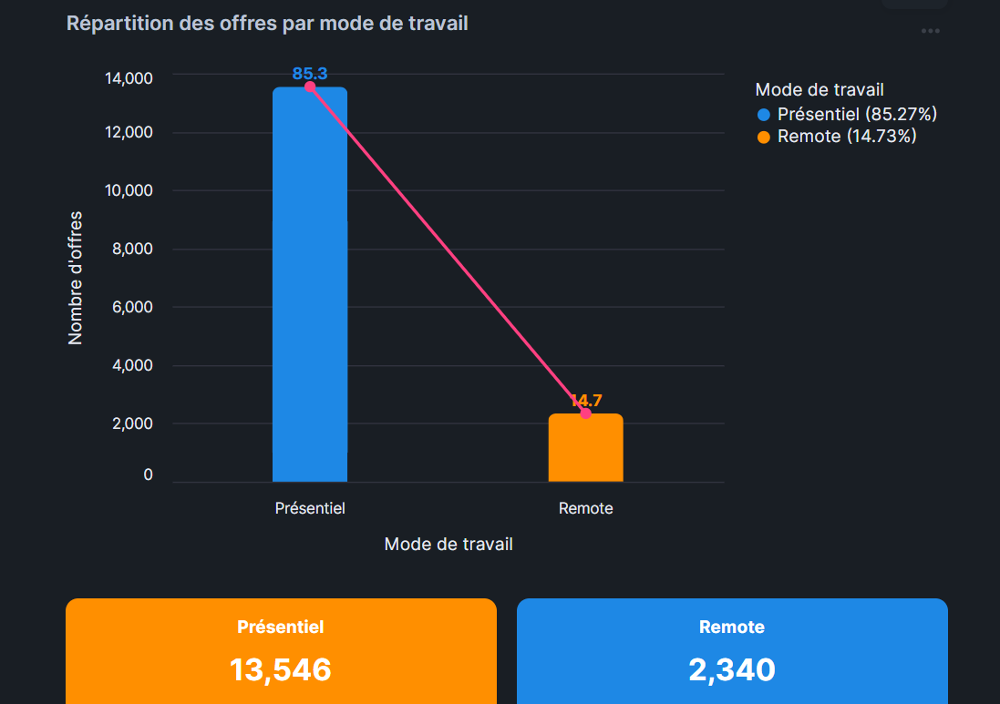
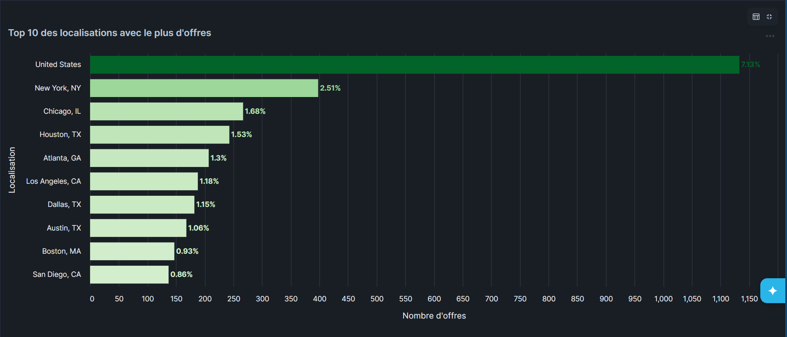
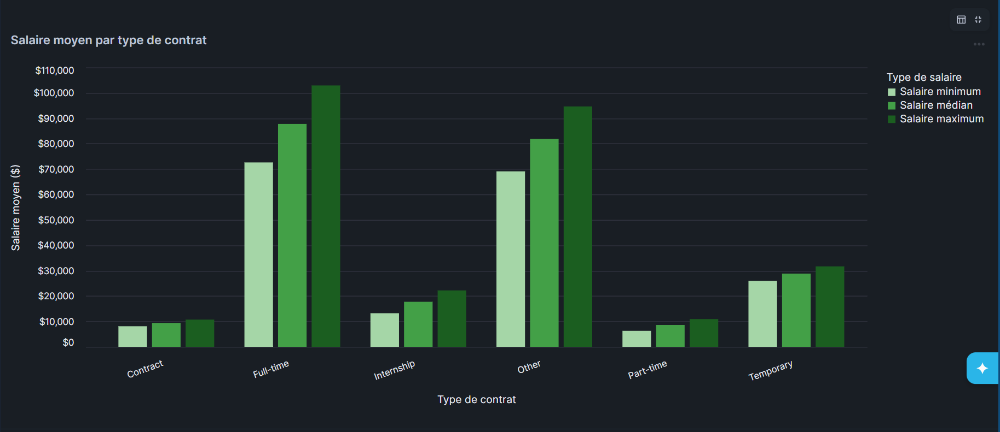

# LinkedIn Jobs Analysis — Snowflake

Ce projet consiste à analyser les offres d'emploi LinkedIn
à partir de fichiers CSV et JSON stockés sur AWS S3.
Les données sont disponibles sur ce bucket : **s3://snowflake-lab-bucket/**

Voici la liste des fichiers à charger :

* job_postings.csv
* benefits.csv
* companies.json
* company_industries.json
* company_specialities.json
* employee_counts.csv
* job_industries.json
* job_skills.csv

Pour pouvoir charger les données dans Snowflake, il faut :
* Créer une base de données **LINKEDIN**
* Créer les schémas **BRONZE**, **SILVER** et **GOLD**
* Créer un stage vers les données sur AWS S3
* Créer un file format pour les données CSV et JSON
* Créer une table pour stocker chaque fichier

---

## 🗄️ Architecture Médaillon

| Couche | Schéma | Rôle |
|--------|--------|------|
| 🟤 Bronze | `LINKEDIN.BRONZE` | Données brutes chargées depuis S3 |
| ⚪ Silver | `LINKEDIN.SILVER` | Données nettoyées et typées |
| 🟡 Gold | `LINKEDIN.GOLD` | Données agrégées prêtes à visualiser |

---

## Étape 1 — Setup

Pour pouvoir charger les données dans Snowflake, il faut créer la base de données, 
les schémas, le stage externe S3 et les formats de fichiers.

```sql
-- Création de la base de données
CREATE DATABASE IF NOT EXISTS LINKEDIN;

-- Création des 3 schémas (Architecture Médaillon)
CREATE SCHEMA IF NOT EXISTS LINKEDIN.BRONZE;
CREATE SCHEMA IF NOT EXISTS LINKEDIN.SILVER;
CREATE SCHEMA IF NOT EXISTS LINKEDIN.GOLD;

-- Création du stage externe pointant vers le bucket S3
CREATE OR REPLACE STAGE LINKEDIN.BRONZE.linkedin_stage
    URL = 's3://snowflake-lab-bucket/';

-- Format pour les fichiers CSV
CREATE OR REPLACE FILE FORMAT LINKEDIN.BRONZE.csv_format
    TYPE = 'CSV'
    SKIP_HEADER = 1
    FIELD_OPTIONALLY_ENCLOSED_BY = '"'
    NULL_IF = ('NULL', 'null', '');

-- Format pour les fichiers JSON
CREATE OR REPLACE FILE FORMAT LINKEDIN.BRONZE.json_format
    TYPE = 'JSON'
    STRIP_OUTER_ARRAY = TRUE;

-- Vérification du contenu du stage
LIST @LINKEDIN.BRONZE.linkedin_stage;
```

> Le `LIST` retourne 8 fichiers confirmant que la connexion S3 est opérationnelle.

## Étape 2 — Création des tables BRONZE

Dans la couche BRONZE, toutes les colonnes sont stockées en `STRING` 
ou `VARIANT` (pour les JSON) afin de conserver les données brutes 
sans aucune transformation.

```sql
USE SCHEMA LINKEDIN.BRONZE;

-- Table job_postings
CREATE TABLE IF NOT EXISTS LINKEDIN.BRONZE.JOB_POSTINGS (
    job_id STRING,
    company_name STRING,
    title STRING,
    description STRING,
    max_salary STRING,
    med_salary STRING,
    min_salary STRING,
    pay_period STRING,
    formatted_work_type STRING,
    location STRING,
    applies STRING,
    original_listed_time STRING,
    remote_allowed STRING,
    views STRING,
    job_posting_url STRING,
    application_url STRING,
    application_type STRING,
    expiry STRING,
    closed_time STRING,
    formatted_experience_level STRING,
    skills_desc STRING,
    listed_time STRING,
    posting_domain STRING,
    sponsored STRING,
    work_type STRING,
    currency STRING,
    compensation_type STRING
);

-- Table benefits
CREATE TABLE IF NOT EXISTS LINKEDIN.BRONZE.BENEFITS (
    job_id STRING,
    inferred STRING,
    type STRING
);

-- Table companies (JSON → VARIANT)
CREATE TABLE IF NOT EXISTS LINKEDIN.BRONZE.COMPANIES (
    data VARIANT
);

-- Table company_industries (JSON → VARIANT)
CREATE TABLE IF NOT EXISTS LINKEDIN.BRONZE.COMPANY_INDUSTRIES (
    data VARIANT
);

-- Table company_specialities (JSON → VARIANT)
CREATE TABLE IF NOT EXISTS LINKEDIN.BRONZE.COMPANY_SPECIALITIES (
    data VARIANT
);

-- Table employee_counts
CREATE TABLE IF NOT EXISTS LINKEDIN.BRONZE.EMPLOYEE_COUNTS (
    company_id STRING,
    employee_count STRING,
    follower_count STRING,
    time_recorded STRING
);

-- Table job_industries (JSON → VARIANT)
CREATE TABLE IF NOT EXISTS LINKEDIN.BRONZE.JOB_INDUSTRIES (
    data VARIANT
);

-- Table job_skills
CREATE TABLE IF NOT EXISTS LINKEDIN.BRONZE.JOB_SKILLS (
    job_id STRING,
    skill_abr STRING
);

-- Vérification des tables créées
SHOW TABLES IN SCHEMA LINKEDIN.BRONZE;
```

> Le `SHOW TABLES` confirme la création des 8 tables dans `LINKEDIN.BRONZE`.

## Étape 3 — Chargement des données BRONZE

Utilisation de `COPY INTO` pour charger chaque fichier depuis le stage S3 
vers les tables BRONZE correspondantes.

```sql
USE SCHEMA LINKEDIN.BRONZE;

-- Chargement de job_postings.csv
COPY INTO LINKEDIN.BRONZE.JOB_POSTINGS
FROM @LINKEDIN.BRONZE.linkedin_stage/job_postings.csv
FILE_FORMAT = (FORMAT_NAME = 'LINKEDIN.BRONZE.csv_format');

-- Chargement de benefits.csv
COPY INTO LINKEDIN.BRONZE.BENEFITS
FROM @LINKEDIN.BRONZE.linkedin_stage/benefits.csv
FILE_FORMAT = (FORMAT_NAME = 'LINKEDIN.BRONZE.csv_format');

-- Chargement de employee_counts.csv
COPY INTO LINKEDIN.BRONZE.EMPLOYEE_COUNTS
FROM @LINKEDIN.BRONZE.linkedin_stage/employee_counts.csv
FILE_FORMAT = (FORMAT_NAME = 'LINKEDIN.BRONZE.csv_format');

-- Chargement de job_skills.csv
COPY INTO LINKEDIN.BRONZE.JOB_SKILLS
FROM @LINKEDIN.BRONZE.linkedin_stage/job_skills.csv
FILE_FORMAT = (FORMAT_NAME = 'LINKEDIN.BRONZE.csv_format');

-- Chargement de companies.json
COPY INTO LINKEDIN.BRONZE.COMPANIES
FROM @LINKEDIN.BRONZE.linkedin_stage/companies.json
FILE_FORMAT = (FORMAT_NAME = 'LINKEDIN.BRONZE.json_format');

-- Chargement de company_industries.json
COPY INTO LINKEDIN.BRONZE.COMPANY_INDUSTRIES
FROM @LINKEDIN.BRONZE.linkedin_stage/company_industries.json
FILE_FORMAT = (FORMAT_NAME = 'LINKEDIN.BRONZE.json_format');

-- Chargement de company_specialities.json
COPY INTO LINKEDIN.BRONZE.COMPANY_SPECIALITIES
FROM @LINKEDIN.BRONZE.linkedin_stage/company_specialities.json
FILE_FORMAT = (FORMAT_NAME = 'LINKEDIN.BRONZE.json_format');

-- Chargement de job_industries.json
COPY INTO LINKEDIN.BRONZE.JOB_INDUSTRIES
FROM @LINKEDIN.BRONZE.linkedin_stage/job_industries.json
FILE_FORMAT = (FORMAT_NAME = 'LINKEDIN.BRONZE.json_format');
```

> Résultats du chargement :

| Table | Nombre de lignes |
|-------|-----------------|
| `JOB_POSTINGS` | 15 886 |
| `BENEFITS` | 13 761 |
| `EMPLOYEE_COUNTS` | 15 907 |
| `JOB_SKILLS` | 27 899 |
| `COMPANIES` | 6 063 |
| `COMPANY_INDUSTRIES` | 15 880 |
| `COMPANY_SPECIALITIES` | 128 355 |
| `JOB_INDUSTRIES` | 21 993 |

## Étape 4 — Couche SILVER (Transformation et nettoyage)

Dans la couche SILVER, on nettoie et type correctement chaque colonne.
Les fichiers JSON sont aplatis via la notation `data:colonne::TYPE`.
Les colonnes booléennes contenant `1.0`/`0.0` sont converties via `CASE WHEN`.
Les timestamps Unix sont convertis en dates lisibles via `TO_TIMESTAMP`.

```sql
USE SCHEMA LINKEDIN.SILVER;

-- Table JOB_POSTINGS nettoyée
CREATE OR REPLACE TABLE LINKEDIN.SILVER.JOB_POSTINGS AS
SELECT
    job_id::INT                                    AS job_id,
    company_name::STRING                           AS company_name,
    title::STRING                                  AS title,
    description::STRING                            AS description,
    max_salary::FLOAT                              AS max_salary,
    med_salary::FLOAT                              AS med_salary,
    min_salary::FLOAT                              AS min_salary,
    pay_period::STRING                             AS pay_period,
    formatted_work_type::STRING                    AS work_type,
    location::STRING                               AS location,
    applies::INT                                   AS applies,
    TO_TIMESTAMP(original_listed_time::INT / 1000) AS original_listed_time,
    CASE
        WHEN remote_allowed = '1.0' THEN TRUE
        WHEN remote_allowed = '0.0' THEN FALSE
        ELSE NULL
    END                                            AS remote_allowed,
    views::INT                                     AS views,
    job_posting_url::STRING                        AS job_posting_url,
    application_url::STRING                        AS application_url,
    application_type::STRING                       AS application_type,
    TO_TIMESTAMP(expiry::INT / 1000)               AS expiry,
    TO_TIMESTAMP(closed_time::INT / 1000)          AS closed_time,
    formatted_experience_level::STRING             AS experience_level,
    skills_desc::STRING                            AS skills_desc,
    TO_TIMESTAMP(listed_time::INT / 1000)          AS listed_time,
    posting_domain::STRING                         AS posting_domain,
    CASE
        WHEN sponsored = '1.0' THEN TRUE
        WHEN sponsored = '0.0' THEN FALSE
        ELSE NULL
    END                                            AS sponsored,
    currency::STRING                               AS currency,
    compensation_type::STRING                      AS compensation_type
FROM LINKEDIN.BRONZE.JOB_POSTINGS;

-- Table BENEFITS nettoyée
CREATE OR REPLACE TABLE LINKEDIN.SILVER.BENEFITS AS
SELECT
    job_id::INT AS job_id,
    CASE
        WHEN inferred = '1.0' THEN TRUE
        WHEN inferred = '0.0' THEN FALSE
        ELSE NULL
    END         AS inferred,
    type::STRING AS type
FROM LINKEDIN.BRONZE.BENEFITS;

-- Table COMPANIES extraite du JSON
CREATE OR REPLACE TABLE LINKEDIN.SILVER.COMPANIES AS
SELECT
    data:company_id::INT     AS company_id,
    data:name::STRING        AS name,
    data:description::STRING AS description,
    data:company_size::INT   AS company_size,
    data:state::STRING       AS state,
    data:country::STRING     AS country,
    data:city::STRING        AS city,
    data:zip_code::STRING    AS zip_code,
    data:address::STRING     AS address,
    data:url::STRING         AS url
FROM LINKEDIN.BRONZE.COMPANIES;

-- Table COMPANY_INDUSTRIES extraite du JSON
CREATE OR REPLACE TABLE LINKEDIN.SILVER.COMPANY_INDUSTRIES AS
SELECT
    data:company_id::INT   AS company_id,
    data:industry::STRING  AS industry
FROM LINKEDIN.BRONZE.COMPANY_INDUSTRIES;

-- Table COMPANY_SPECIALITIES extraite du JSON
CREATE OR REPLACE TABLE LINKEDIN.SILVER.COMPANY_SPECIALITIES AS
SELECT
    data:company_id::INT    AS company_id,
    data:speciality::STRING AS speciality
FROM LINKEDIN.BRONZE.COMPANY_SPECIALITIES;

-- Table EMPLOYEE_COUNTS nettoyée
CREATE OR REPLACE TABLE LINKEDIN.SILVER.EMPLOYEE_COUNTS AS
SELECT
    company_id::INT                         AS company_id,
    employee_count::INT                     AS employee_count,
    follower_count::INT                     AS follower_count,
    TO_TIMESTAMP(time_recorded::INT / 1000) AS time_recorded
FROM LINKEDIN.BRONZE.EMPLOYEE_COUNTS;

-- Table JOB_INDUSTRIES extraite du JSON
CREATE OR REPLACE TABLE LINKEDIN.SILVER.JOB_INDUSTRIES AS
SELECT
    data:job_id::INT      AS job_id,
    data:industry_id::INT AS industry_id
FROM LINKEDIN.BRONZE.JOB_INDUSTRIES;

-- Table JOB_SKILLS nettoyée
CREATE OR REPLACE TABLE LINKEDIN.SILVER.JOB_SKILLS AS
SELECT
    job_id::INT       AS job_id,
    skill_abr::STRING AS skill_abr
FROM LINKEDIN.BRONZE.JOB_SKILLS;

-- Vérification globale
SHOW TABLES IN SCHEMA LINKEDIN.SILVER;
```

> **Problème rencontré :** Les colonnes booléennes `remote_allowed`, `sponsored`
> et `inferred` contenaient des valeurs `1.0`/`0.0` non reconnues par Snowflake.
> **Solution :** Utilisation d'un `CASE WHEN` pour convertir manuellement ces valeurs.

## Étape 5 — Couche GOLD (Analyses)

Les 10 analyses sont créées sous forme de vues dans la couche GOLD,
prêtes à être consommées par Streamlit.

### Description des vues GOLD

| Vue | Description |
|-----|-------------|
| `TOP_TITLES_BY_INDUSTRY` | Top 10 des titres de postes les plus publiés par industrie |
| `TOP_SALARIES_BY_INDUSTRY` | Top 10 des postes les mieux rémunérés par industrie |
| `POSTINGS_BY_COMPANY_SIZE` | Répartition des offres par taille d'entreprise |
| `POSTINGS_BY_INDUSTRY` | Répartition des offres par secteur d'activité |
| `POSTINGS_BY_WORK_TYPE` | Répartition des offres par type d'emploi |
| `TOP_RECRUITING_COMPANIES` | Top 10 des entreprises qui recrutent le plus |
| `POSTINGS_BY_EXPERIENCE` | Répartition des offres par niveau d'expérience |
| `POSTINGS_BY_REMOTE` | Répartition Remote vs Présentiel |
| `TOP_LOCATIONS` | Top 10 des localisations avec le plus d'offres |
| `AVG_SALARY_BY_WORK_TYPE` | Salaire moyen par type de contrat |

---

### Analyse 1 — Top 10 des titres de postes les plus publiés par industrie
Jointure entre `JOB_POSTINGS`, `COMPANIES` et `COMPANY_INDUSTRIES`.
Utilisation de `ROW_NUMBER()` pour classer les titres par industrie.

```sql
CREATE OR REPLACE VIEW LINKEDIN.GOLD.TOP_TITLES_BY_INDUSTRY AS
SELECT
    ci.industry                     AS industry,
    jp.title                        AS job_title,
    COUNT(*)                        AS nb_postings,
    ROW_NUMBER() OVER (
        PARTITION BY ci.industry
        ORDER BY COUNT(*) DESC
    )                               AS rank
FROM LINKEDIN.SILVER.JOB_POSTINGS jp
JOIN LINKEDIN.SILVER.COMPANIES c
    ON jp.company_name::FLOAT::INT = c.company_id
JOIN LINKEDIN.SILVER.COMPANY_INDUSTRIES ci
    ON c.company_id = ci.company_id
GROUP BY ci.industry, jp.title
QUALIFY rank <= 10;
```

---

### Analyse 2 — Top 10 des postes les mieux rémunérés par industrie
Le salaire médian étant absent des données sources, il est calculé
comme la moyenne entre le salaire minimum et maximum.

```sql
CREATE OR REPLACE VIEW LINKEDIN.GOLD.TOP_SALARIES_BY_INDUSTRY AS
SELECT
    ci.industry                                         AS industry,
    jp.title                                            AS job_title,
    ROUND(AVG(jp.max_salary), 2)                        AS avg_max_salary,
    ROUND(AVG((jp.max_salary + jp.min_salary) / 2), 2)  AS avg_med_salary,
    ROUND(AVG(jp.min_salary), 2)                        AS avg_min_salary,
    COUNT(*)                                            AS nb_postings,
    ROW_NUMBER() OVER (
        PARTITION BY ci.industry
        ORDER BY AVG(jp.max_salary) DESC
    )                                                   AS rank
FROM LINKEDIN.SILVER.JOB_POSTINGS jp
JOIN LINKEDIN.SILVER.COMPANIES c
    ON jp.company_name::FLOAT::INT = c.company_id
JOIN LINKEDIN.SILVER.COMPANY_INDUSTRIES ci
    ON c.company_id = ci.company_id
WHERE jp.max_salary IS NOT NULL
AND jp.min_salary IS NOT NULL
GROUP BY ci.industry, jp.title
QUALIFY rank <= 10;
```

---

### Analyse 3 — Répartition des offres par taille d'entreprise
La colonne `company_size` contient des valeurs de 0 à 7.
Un `CASE WHEN` permet de les convertir en labels lisibles.

```sql
CREATE OR REPLACE VIEW LINKEDIN.GOLD.POSTINGS_BY_COMPANY_SIZE AS
SELECT
    CASE c.company_size
        WHEN 0 THEN '0 - Très petite (1-10)'
        WHEN 1 THEN '1 - Petite (11-50)'
        WHEN 2 THEN '2 - Moyenne (51-200)'
        WHEN 3 THEN '3 - Intermédiaire (201-500)'
        WHEN 4 THEN '4 - Grande (501-1000)'
        WHEN 5 THEN '5 - Très grande (1001-5000)'
        WHEN 6 THEN '6 - Très grande (5001-10000)'
        WHEN 7 THEN '7 - Entreprise (10000+)'
        ELSE 'Non renseigné'
    END                             AS company_size_label,
    COUNT(*)                        AS nb_postings
FROM LINKEDIN.SILVER.JOB_POSTINGS jp
JOIN LINKEDIN.SILVER.COMPANIES c
    ON jp.company_name::FLOAT::INT = c.company_id
GROUP BY c.company_size
ORDER BY c.company_size;
```

---

### Analyse 4 — Répartition des offres par secteur d'activité
Jointure entre `JOB_POSTINGS` et `JOB_INDUSTRIES`.
Limite aux 20 secteurs les plus représentés.

```sql
CREATE OR REPLACE VIEW LINKEDIN.GOLD.POSTINGS_BY_INDUSTRY AS
SELECT
    ji.industry_id::STRING          AS industry,
    COUNT(*)                        AS nb_postings
FROM LINKEDIN.SILVER.JOB_POSTINGS jp
JOIN LINKEDIN.SILVER.JOB_INDUSTRIES ji
    ON jp.job_id = ji.job_id
GROUP BY ji.industry_id
ORDER BY nb_postings DESC
LIMIT 20;
```

---

### Analyse 5 — Répartition des offres par type d'emploi
Utilisation de la fonction fenêtre `SUM() OVER()` pour calculer
les pourcentages par rapport au total des offres.

```sql
CREATE OR REPLACE VIEW LINKEDIN.GOLD.POSTINGS_BY_WORK_TYPE AS
SELECT
    work_type                       AS work_type,
    COUNT(*)                        AS nb_postings,
    ROUND(COUNT(*) * 100.0 /
        SUM(COUNT(*)) OVER (), 2)   AS percentage
FROM LINKEDIN.SILVER.JOB_POSTINGS
WHERE work_type IS NOT NULL
GROUP BY work_type
ORDER BY nb_postings DESC;
```

---

### Analyse 6 — Top 10 des entreprises qui recrutent le plus

```sql
CREATE OR REPLACE VIEW LINKEDIN.GOLD.TOP_RECRUITING_COMPANIES AS
SELECT
    c.name                          AS company_name,
    COUNT(*)                        AS nb_postings,
    CASE c.company_size
        WHEN 0 THEN 'Très petite (1-10)'
        WHEN 1 THEN 'Petite (11-50)'
        WHEN 2 THEN 'Moyenne (51-200)'
        WHEN 3 THEN 'Intermédiaire (201-500)'
        WHEN 4 THEN 'Grande (501-1000)'
        WHEN 5 THEN 'Très grande (1001-5000)'
        WHEN 6 THEN 'Très grande (5001-10000)'
        WHEN 7 THEN 'Entreprise (10000+)'
        ELSE 'Non renseigné'
    END                             AS company_size_label
FROM LINKEDIN.SILVER.JOB_POSTINGS jp
JOIN LINKEDIN.SILVER.COMPANIES c
    ON jp.company_name::FLOAT::INT = c.company_id
GROUP BY c.name, c.company_size
ORDER BY nb_postings DESC
LIMIT 10;
```

---

### Analyse 7 — Répartition des offres par niveau d'expérience
Utilisation de la fonction fenêtre `SUM() OVER()` pour calculer
les pourcentages par rapport au total des offres.
Les offres sans niveau d'expérience renseigné sont exclues.

```sql
CREATE OR REPLACE VIEW LINKEDIN.GOLD.POSTINGS_BY_EXPERIENCE AS
SELECT
    experience_level                    AS experience_level,
    COUNT(*)                            AS nb_postings,
    ROUND(COUNT(*) * 100.0 /
        SUM(COUNT(*)) OVER (), 2)       AS percentage
FROM LINKEDIN.SILVER.JOB_POSTINGS
WHERE experience_level IS NOT NULL
GROUP BY experience_level
ORDER BY nb_postings DESC;

-- Vérification
SELECT * FROM LINKEDIN.GOLD.POSTINGS_BY_EXPERIENCE;
```

---

### Analyse 8 — Répartition Remote / Présentiel / Hybride
La colonne `remote_allowed` ne contenant que des valeurs `TRUE`,
nous utilisons la colonne `work_type` pour distinguer les trois
modes de travail via un `CASE WHEN` avec des patterns `LIKE`.

```sql
CREATE OR REPLACE VIEW LINKEDIN.GOLD.POSTINGS_BY_WORK_MODE AS
SELECT
    CASE
        WHEN LOWER(work_type) LIKE '%remote%'   THEN 'Remote'
        WHEN LOWER(work_type) LIKE '%hybrid%'   THEN 'Hybride'
        WHEN LOWER(work_type) LIKE '%on%site%'  THEN 'Présentiel'
        WHEN LOWER(work_type) LIKE '%office%'   THEN 'Présentiel'
        WHEN remote_allowed = TRUE              THEN 'Remote'
        ELSE 'Présentiel'
    END                                         AS work_mode,
    COUNT(*)                                    AS nb_postings,
    ROUND(COUNT(*) * 100.0 /
        SUM(COUNT(*)) OVER (), 2)               AS percentage
FROM LINKEDIN.SILVER.JOB_POSTINGS
WHERE work_type IS NOT NULL
GROUP BY
    CASE
        WHEN LOWER(work_type) LIKE '%remote%'   THEN 'Remote'
        WHEN LOWER(work_type) LIKE '%hybrid%'   THEN 'Hybride'
        WHEN LOWER(work_type) LIKE '%on%site%'  THEN 'Présentiel'
        WHEN LOWER(work_type) LIKE '%office%'   THEN 'Présentiel'
        WHEN remote_allowed = TRUE              THEN 'Remote'
        ELSE 'Présentiel'
    END
ORDER BY nb_postings DESC;

-- Vérification
SELECT * FROM LINKEDIN.GOLD.POSTINGS_BY_WORK_MODE;
```

> **Note :** La colonne `remote_allowed` ne contenait que des valeurs
> `TRUE` dans le dataset source, rendant l'analyse Remote vs Présentiel
> non pertinente avec cette seule colonne. La solution adoptée utilise
> la colonne `work_type` combinée à des patterns `LIKE` pour détecter
> les trois modes de travail : Remote, Hybride et Présentiel.

### Analyse 9 — Top 10 des localisations avec le plus d'offres

```sql
CREATE OR REPLACE VIEW LINKEDIN.GOLD.TOP_LOCATIONS AS
SELECT
    location                        AS location,
    COUNT(*)                        AS nb_postings,
    ROUND(COUNT(*) * 100.0 /
        SUM(COUNT(*)) OVER (), 2)   AS percentage
FROM LINKEDIN.SILVER.JOB_POSTINGS
WHERE location IS NOT NULL
GROUP BY location
ORDER BY nb_postings DESC
LIMIT 10;
```

---

### Analyse 10 — Salaire moyen par type de contrat
Le salaire médian est calculé comme la moyenne entre min et max
car le champ `med_salary` est absent des données sources.

```sql
CREATE OR REPLACE VIEW LINKEDIN.GOLD.AVG_SALARY_BY_WORK_TYPE AS
SELECT
    work_type                                       AS work_type,
    ROUND(AVG(max_salary), 2)                       AS avg_max_salary,
    ROUND(AVG((max_salary + min_salary) / 2), 2)    AS avg_med_salary,
    ROUND(AVG(min_salary), 2)                       AS avg_min_salary,
    COUNT(*)                                        AS nb_postings
FROM LINKEDIN.SILVER.JOB_POSTINGS
WHERE max_salary IS NOT NULL
AND min_salary IS NOT NULL
AND work_type IS NOT NULL
GROUP BY work_type
ORDER BY avg_max_salary DESC;
```
> Résultats de l'analyse 5 — Répartition par type d'emploi :

| Type d'emploi | Nombre d'offres | Pourcentage |
|---------------|----------------|-------------|
| Full-time | 12 844 | 80.85% |
| Contract | 1 739 | 10.95% |
| Part-time | 1 010 | 6.36% |
| Temporary | 121 | 0.70% |
| Internship | 111 | 0.70% |
| Other | 53 | 0.33% |
| Volunteer | 8 | 0.05% |

## Étape 6 — Visualisations Streamlit

Création d'un dashboard interactif avec 10 visualisations
hébergé directement dans Snowflake via Streamlit.

### Stack de visualisation

| Bibliothèque | Rôle |
|-------------|------|
| `streamlit` | Framework du dashboard |
| `altair` | Graphiques interactifs |
| `pandas` | Manipulation des données |

### Choix des graphiques

| # | Analyse | Graphique | Justification |
|---|---------|-----------|---------------|
| 1 | Top 10 titres par industrie | Barres horizontales bleues | Comparaison de noms longs |
| 2 | Top 10 salaires par industrie | Barres groupées | Comparer min/médian/max |
| 3 | Taille d'entreprise | Barres verticales | Données ordonnées 0 à 7 |
| 4 | Secteur d'activité | Barres horizontales teal | Beaucoup de catégories |
| 5 | Type d'emploi | Barres horizontales | Comparaison avec pourcentages |
| 6 | Top entreprises | Barres horizontales oranges | Classement clair |
| 7 | Niveau d'expérience | Camembert | Peu de catégories, proportions |
| 8 | Remote / Présentiel / Hybride | Barres + courbe + métriques | Vue synthétique |
| 9 | Localisations | Barres horizontales vertes | Classement géographique |
| 10 | Salaire par contrat | Barres groupées vertes | Comparer min/médian/max |

---

### Analyse 1 — Top 10 des titres de postes les plus publiés par industrie
**Graphique :** Barres horizontales avec dégradé bleu
**Interactivité :** Menu déroulant de sélection d'industrie

```python
st.header("📊 Analyse 1 — Top 10 des titres de postes les plus publiés par industrie")

industries = session.sql("""
    SELECT DISTINCT industry
    FROM LINKEDIN.GOLD.TOP_TITLES_BY_INDUSTRY
    ORDER BY industry
""").to_pandas()
industry_list = industries["INDUSTRY"].tolist()
selected_industry_1 = st.selectbox("Sélectionne une industrie :", industry_list, key="industry_1")

data_1 = session.sql(f"""
    SELECT job_title, nb_postings
    FROM LINKEDIN.GOLD.TOP_TITLES_BY_INDUSTRY
    WHERE industry = '{selected_industry_1}'
    ORDER BY nb_postings DESC
""").to_pandas()
data_1.columns = [c.lower() for c in data_1.columns]

bars1 = alt.Chart(data_1).mark_bar().encode(
    x=alt.X("nb_postings:Q", title="Nombre d'offres publiées"),
    y=alt.Y("job_title:N", sort="-x", title="Titre du poste"),
    color=alt.Color("nb_postings:Q", scale=alt.Scale(scheme="blues"), legend=None),
    tooltip=[alt.Tooltip("job_title:N", title="Poste"), alt.Tooltip("nb_postings:Q", title="Nombre d'offres")]
).properties(title=f"Top 10 des titres les plus publiés — {selected_industry_1}", height=400)

text1 = bars1.mark_text(align="left", dx=3, color="white", fontSize=12).encode(
    text=alt.Text("nb_postings:Q")
)
st.altair_chart((bars1 + text1), use_container_width=True)
st.subheader("Données brutes")
st.dataframe(data_1, use_container_width=True)
st.divider()
```



---

### Analyse 2 — Top 10 des postes les mieux rémunérés par industrie
**Graphique :** Barres groupées (salaire min / médian / max)
**Interactivité :** Menu déroulant de sélection d'industrie

```python
st.header("💰 Analyse 2 — Top 10 des postes les mieux rémunérés par industrie")

selected_industry_2 = st.selectbox("Sélectionne une industrie :", industry_list, key="industry_2")

data_2 = session.sql(f"""
    SELECT job_title, avg_max_salary, avg_med_salary, avg_min_salary
    FROM LINKEDIN.GOLD.TOP_SALARIES_BY_INDUSTRY
    WHERE industry = '{selected_industry_2}'
    ORDER BY avg_max_salary DESC
""").to_pandas()
data_2.columns = [c.lower() for c in data_2.columns]

data_2_melted = data_2.melt(
    id_vars="job_title",
    value_vars=["avg_min_salary", "avg_med_salary", "avg_max_salary"],
    var_name="type_salaire",
    value_name="salaire"
)
salary_labels = {
    "avg_min_salary": "Salaire minimum",
    "avg_med_salary": "Salaire médian",
    "avg_max_salary": "Salaire maximum"
}
data_2_melted["type_salaire_label"] = data_2_melted["type_salaire"].map(salary_labels)

fig2 = alt.Chart(data_2_melted).mark_bar().encode(
    x=alt.X("job_title:N", title="Titre du poste", axis=alt.Axis(labelAngle=-30)),
    y=alt.Y("salaire:Q", title="Salaire annuel ($)", axis=alt.Axis(format="$,.0f")),
    color=alt.Color(
        "type_salaire_label:N",
        scale=alt.Scale(
            domain=["Salaire minimum", "Salaire médian", "Salaire maximum"],
            range=["#90CAF9", "#1E88E5", "#0D47A1"]
        ),
        legend=alt.Legend(title="Type de salaire")
    ),
    xOffset="type_salaire_label:N",
    tooltip=[
        alt.Tooltip("job_title:N", title="Poste"),
        alt.Tooltip("type_salaire_label:N", title="Type"),
        alt.Tooltip("salaire:Q", title="Salaire ($)", format="$,.0f")
    ]
).properties(title=f"Top 10 des salaires — {selected_industry_2}", height=450)

st.altair_chart(fig2, use_container_width=True)
st.subheader("Données brutes")
st.dataframe(data_2, use_container_width=True)
st.divider()
```



---

### Analyse 3 — Répartition des offres par taille d'entreprise
**Graphique :** Barres verticales avec pourcentages
**Interactivité :** Tooltip au survol

```python
st.header("🏢 Analyse 3 — Répartition des offres par taille d'entreprise")

data_3 = session.sql("""
    SELECT company_size_label, nb_postings
    FROM LINKEDIN.GOLD.POSTINGS_BY_COMPANY_SIZE
    ORDER BY company_size_label
""").to_pandas()
data_3.columns = [c.lower() for c in data_3.columns]
data_3["percentage"] = (data_3["nb_postings"] / data_3["nb_postings"].sum() * 100).round(1)
data_3["label"] = data_3["percentage"].astype(str) + "%"

bars3 = alt.Chart(data_3).mark_bar().encode(
    x=alt.X("company_size_label:N", title="Taille d'entreprise", sort=None, axis=alt.Axis(labelAngle=-20)),
    y=alt.Y("nb_postings:Q", title="Nombre d'offres"),
    color=alt.Color("company_size_label:N", scale=alt.Scale(scheme="tableau10"), legend=None),
    tooltip=[
        alt.Tooltip("company_size_label:N", title="Taille"),
        alt.Tooltip("nb_postings:Q", title="Offres"),
        alt.Tooltip("label:N", title="Pourcentage")
    ]
).properties(title="Répartition des offres par taille d'entreprise", height=400)

text3 = bars3.mark_text(align="center", dy=-10, color="white", fontSize=12, fontWeight="bold").encode(
    text=alt.Text("label:N")
)
st.altair_chart((bars3 + text3), use_container_width=True)
st.subheader("Données brutes")
st.dataframe(data_3, use_container_width=True)
st.divider()
```



---

### Analyse 4 — Répartition des offres par secteur d'activité
**Graphique :** Barres horizontales avec dégradé teal et pourcentages
**Interactivité :** Tooltip au survol

```python
st.header("🏭 Analyse 4 — Répartition des offres par secteur d'activité")

data_4 = session.sql("""
    SELECT industry, nb_postings
    FROM LINKEDIN.GOLD.POSTINGS_BY_INDUSTRY
    ORDER BY nb_postings DESC
""").to_pandas()
data_4.columns = [c.lower() for c in data_4.columns]
data_4["percentage"] = (data_4["nb_postings"] / data_4["nb_postings"].sum() * 100).round(1)
data_4["label"] = data_4["percentage"].astype(str) + "%"

bars4 = alt.Chart(data_4).mark_bar().encode(
    x=alt.X("nb_postings:Q", title="Nombre d'offres"),
    y=alt.Y("industry:N", sort="-x", title="Secteur d'activité"),
    color=alt.Color("nb_postings:Q", scale=alt.Scale(scheme="tealblues"), legend=None),
    tooltip=[
        alt.Tooltip("industry:N", title="Secteur"),
        alt.Tooltip("nb_postings:Q", title="Offres"),
        alt.Tooltip("label:N", title="Pourcentage")
    ]
).properties(title="Top 20 des secteurs d'activité les plus représentés", height=500)

text4 = bars4.mark_text(align="left", dx=3, color="white", fontSize=11).encode(
    text=alt.Text("label:N")
)
st.altair_chart((bars4 + text4), use_container_width=True)
st.subheader("Données brutes")
st.dataframe(data_4, use_container_width=True)
st.divider()
```



---

### Analyse 5 — Répartition des offres par type d'emploi
**Graphique :** Barres horizontales multicolores avec pourcentages
**Interactivité :** Tooltip au survol

```python
st.header("⏱️ Analyse 5 — Répartition des offres par type d'emploi")

data_5 = session.sql("""
    SELECT work_type, nb_postings, percentage
    FROM LINKEDIN.GOLD.POSTINGS_BY_WORK_TYPE
""").to_pandas()
data_5.columns = [c.lower() for c in data_5.columns]
data_5["label"] = data_5["percentage"].astype(str) + "%"

bars5 = alt.Chart(data_5).mark_bar().encode(
    x=alt.X("nb_postings:Q", title="Nombre d'offres"),
    y=alt.Y("work_type:N", sort="-x", title="Type d'emploi"),
    color=alt.Color("work_type:N", scale=alt.Scale(scheme="set2"), legend=None),
    tooltip=[
        alt.Tooltip("work_type:N", title="Type d'emploi"),
        alt.Tooltip("nb_postings:Q", title="Offres"),
        alt.Tooltip("label:N", title="Pourcentage")
    ]
).properties(title="Répartition des offres par type d'emploi", height=350)

text5 = bars5.mark_text(align="left", dx=3, color="white", fontSize=12, fontWeight="bold").encode(
    text=alt.Text("label:N")
)
st.altair_chart((bars5 + text5), use_container_width=True)
st.subheader("Données brutes")
st.dataframe(data_5, use_container_width=True)
st.divider()
```



---

### Analyse 6 — Top 10 des entreprises qui recrutent le plus
**Graphique :** Barres horizontales avec dégradé orange
**Interactivité :** Tooltip au survol avec taille d'entreprise

```python
st.header("🏆 Analyse 6 — Top 10 des entreprises qui recrutent le plus")

data_6 = session.sql("""
    SELECT company_name, nb_postings, company_size_label
    FROM LINKEDIN.GOLD.TOP_RECRUITING_COMPANIES
    ORDER BY nb_postings DESC
""").to_pandas()
data_6.columns = [c.lower() for c in data_6.columns]

bars6 = alt.Chart(data_6).mark_bar().encode(
    x=alt.X("nb_postings:Q", title="Nombre d'offres"),
    y=alt.Y("company_name:N", sort="-x", title="Entreprise"),
    color=alt.Color("nb_postings:Q", scale=alt.Scale(scheme="oranges"), legend=None),
    tooltip=[
        alt.Tooltip("company_name:N", title="Entreprise"),
        alt.Tooltip("nb_postings:Q", title="Offres"),
        alt.Tooltip("company_size_label:N", title="Taille")
    ]
).properties(title="Top 10 des entreprises qui recrutent le plus", height=400)

text6 = bars6.mark_text(align="left", dx=3, color="white", fontSize=12, fontWeight="bold").encode(
    text=alt.Text("nb_postings:Q")
)
st.altair_chart((bars6 + text6), use_container_width=True)
st.subheader("Données brutes")
st.dataframe(data_6, use_container_width=True)
st.divider()
```



---

### Analyse 7 — Répartition des offres par niveau d'expérience
**Graphique :** Camembert avec pourcentages dans la légende
**Interactivité :** Tooltip au survol

```python
st.header("🎓 Analyse 7 — Répartition des offres par niveau d'expérience")

data_7 = session.sql("""
    SELECT experience_level, nb_postings, percentage
    FROM LINKEDIN.GOLD.POSTINGS_BY_EXPERIENCE
""").to_pandas()
data_7.columns = [c.lower() for c in data_7.columns]
data_7["legend_label"] = data_7["experience_level"] + " (" + data_7["percentage"].astype(str) + "%)"

base7 = alt.Chart(data_7).encode(
    theta=alt.Theta("nb_postings:Q", stack=True),
    color=alt.Color(
        "legend_label:N",
        scale=alt.Scale(
            domain=[row["legend_label"] for _, row in data_7.iterrows()],
            range=["#1E88E5", "#43A047", "#E53935", "#FB8C00", "#8E24AA", "#00ACC1"]
        ),
        legend=alt.Legend(title="Niveau d'expérience")
    ),
    tooltip=[
        alt.Tooltip("experience_level:N", title="Niveau"),
        alt.Tooltip("nb_postings:Q", title="Nombre d'offres"),
        alt.Tooltip("percentage:Q", title="Pourcentage", format=".2f")
    ]
)

pie7 = base7.mark_arc(innerRadius=0, outerRadius=180)
fig7 = pie7.properties(
    title="Répartition des offres par niveau d'expérience",
    height=450
)
st.altair_chart(fig7, use_container_width=True)
st.subheader("Données brutes")
st.dataframe(data_7, use_container_width=True)
st.divider()
```

> **Choix du graphique :** Le camembert est optimal ici car il y a peu
> de catégories (6 niveaux d'expérience) et on cherche à visualiser
> des proportions. Les pourcentages sont affichés dans la légende
> pour éviter tout chevauchement sur les petites parts.



---

### Analyse 8 — Répartition Remote / Présentiel / Hybride
**Graphique :** Barres + courbe combinées + métriques colorées
**Interactivité :** Tooltip au survol

> **Note :** La colonne `remote_allowed` ne contenait que des valeurs
> `TRUE` dans le dataset source. La solution adoptée utilise la colonne
> `work_type` combinée à des patterns `LIKE` pour détecter les trois
> modes de travail : Remote, Hybride et Présentiel.

```python
st.header("🌍 Analyse 8 — Répartition Remote / Présentiel / Hybride")

data_8 = session.sql("""
    SELECT work_mode, nb_postings, percentage
    FROM LINKEDIN.GOLD.POSTINGS_BY_WORK_MODE
    ORDER BY nb_postings DESC
""").to_pandas()
data_8.columns = [c.lower() for c in data_8.columns]
data_8["legend_label"] = data_8["work_mode"] + " (" + data_8["percentage"].astype(str) + "%)"

bars8 = alt.Chart(data_8).mark_bar(
    cornerRadiusTopLeft=6,
    cornerRadiusTopRight=6,
    size=60
).encode(
    x=alt.X("work_mode:N", title="Mode de travail", axis=alt.Axis(labelAngle=0),
        sort=alt.SortField("nb_postings", order="descending")),
    y=alt.Y("nb_postings:Q", title="Nombre d'offres", axis=alt.Axis(grid=True)),
    color=alt.Color(
        "legend_label:N",
        scale=alt.Scale(
            domain=[row["legend_label"] for _, row in data_8.iterrows()],
            range=["#1E88E5", "#FF8F00", "#43A047", "#9E9E9E"]
        ),
        legend=alt.Legend(title="Mode de travail")
    ),
    tooltip=[
        alt.Tooltip("work_mode:N", title="Mode"),
        alt.Tooltip("nb_postings:Q", title="Nombre d'offres"),
        alt.Tooltip("percentage:Q", title="Pourcentage", format=".2f")
    ]
)

text8 = bars8.mark_text(
    align="center", dy=-10, fontSize=13, fontWeight="bold", color="white"
).encode(text=alt.Text("percentage:Q", format=".1f"))

line8 = alt.Chart(data_8).mark_line(
    color="#FF4081", strokeWidth=2.5,
    point=alt.OverlayMarkDef(color="#FF4081", size=80, filled=True)
).encode(
    x=alt.X("work_mode:N", sort=alt.SortField("nb_postings", order="descending")),
    y=alt.Y("nb_postings:Q"),
    tooltip=[
        alt.Tooltip("work_mode:N", title="Mode"),
        alt.Tooltip("nb_postings:Q", title="Nombre d'offres")
    ]
)

fig8 = (bars8 + text8 + line8).properties(
    title="Répartition des offres par mode de travail",
    height=450
).resolve_scale(y="shared")

st.altair_chart(fig8, use_container_width=True)

cols = st.columns(len(data_8))
colors_map = {"Remote": "#1E88E5", "Présentiel": "#FF8F00", "Hybride": "#43A047"}

for i, (_, row) in enumerate(data_8.iterrows()):
    color = colors_map.get(row["work_mode"], "#9E9E9E")
    cols[i].markdown(f"""
    <div style="background:{color}; border-radius:10px; padding:12px; text-align:center;">
        <p style="color:white; font-size:14px; font-weight:bold; margin:0;">{row['work_mode']}</p>
        <p style="color:white; font-size:24px; font-weight:bold; margin:4px 0;">{int(row['nb_postings']):,}</p>
        <p style="color:white; font-size:14px; margin:0;">{row['percentage']}%</p>
    </div>
    """, unsafe_allow_html=True)

st.subheader("Données brutes")
st.dataframe(data_8, use_container_width=True)
st.divider()
```

> **Choix du graphique :** La combinaison barres + courbe est optimale
> pour comparer des catégories tout en montrant la tendance relative.
> Les métriques colorées en bas permettent une lecture rapide des chiffres clés.



---

### Analyse 9 — Top 10 des localisations avec le plus d'offres
**Graphique :** Barres horizontales vertes avec pourcentages
**Interactivité :** Tooltip au survol

```python
st.header("📍 Analyse 9 — Top 10 des localisations avec le plus d'offres")

data_9 = session.sql("""
    SELECT location, nb_postings, percentage
    FROM LINKEDIN.GOLD.TOP_LOCATIONS
    ORDER BY nb_postings DESC
""").to_pandas()
data_9.columns = [c.lower() for c in data_9.columns]
data_9["label"] = data_9["percentage"].astype(str) + "%"

bars9 = alt.Chart(data_9).mark_bar().encode(
    x=alt.X("nb_postings:Q", title="Nombre d'offres"),
    y=alt.Y("location:N", sort="-x", title="Localisation"),
    color=alt.Color("nb_postings:Q", scale=alt.Scale(scheme="greens"), legend=None),
    tooltip=[
        alt.Tooltip("location:N", title="Localisation"),
        alt.Tooltip("nb_postings:Q", title="Offres"),
        alt.Tooltip("label:N", title="Pourcentage")
    ]
).properties(title="Top 10 des localisations avec le plus d'offres", height=400)

text9 = bars9.mark_text(
    align="left", dx=3, color="white", fontSize=12, fontWeight="bold"
).encode(text=alt.Text("label:N"))

st.altair_chart((bars9 + text9), use_container_width=True)
st.subheader("Données brutes")
st.dataframe(data_9, use_container_width=True)
st.divider()
```

> **Choix du graphique :** Les barres horizontales sont optimales
> pour comparer des noms de villes longs. Le dégradé vert permet
> une lecture rapide du classement.



---

### Analyse 10 — Salaire moyen par type de contrat
**Graphique :** Barres groupées vertes (min / médian / max)
**Interactivité :** Tooltip au survol avec formatage monétaire

```python
st.header("💵 Analyse 10 — Salaire moyen par type de contrat")

data_10 = session.sql("""
    SELECT work_type, avg_max_salary, avg_med_salary, avg_min_salary, nb_postings
    FROM LINKEDIN.GOLD.AVG_SALARY_BY_WORK_TYPE
    ORDER BY avg_max_salary DESC
""").to_pandas()
data_10.columns = [c.lower() for c in data_10.columns]

data_10_melted = data_10.melt(
    id_vars="work_type",
    value_vars=["avg_min_salary", "avg_med_salary", "avg_max_salary"],
    var_name="type_salaire",
    value_name="salaire"
)
salary_labels_10 = {
    "avg_min_salary": "Salaire minimum",
    "avg_med_salary": "Salaire médian",
    "avg_max_salary": "Salaire maximum"
}
data_10_melted["type_salaire_label"] = data_10_melted["type_salaire"].map(salary_labels_10)
data_10_melted = data_10_melted.dropna(subset=["salaire"])

fig10 = alt.Chart(data_10_melted).mark_bar().encode(
    x=alt.X("work_type:N", title="Type de contrat", axis=alt.Axis(labelAngle=-20)),
    y=alt.Y("salaire:Q", title="Salaire moyen ($)", axis=alt.Axis(format="$,.0f")),
    color=alt.Color(
        "type_salaire_label:N",
        scale=alt.Scale(
            domain=["Salaire minimum", "Salaire médian", "Salaire maximum"],
            range=["#A5D6A7", "#43A047", "#1B5E20"]
        ),
        legend=alt.Legend(title="Type de salaire")
    ),
    xOffset="type_salaire_label:N",
    tooltip=[
        alt.Tooltip("work_type:N", title="Type de contrat"),
        alt.Tooltip("type_salaire_label:N", title="Type"),
        alt.Tooltip("salaire:Q", title="Salaire ($)", format="$,.0f")
    ]
).properties(title="Salaire moyen par type de contrat", height=400)

st.altair_chart(fig10, use_container_width=True)
st.subheader("Données brutes")
st.dataframe(data_10, use_container_width=True)
```

> **Choix du graphique :** Les barres groupées permettent de comparer
> simultanément les trois niveaux de salaire (min/médian/max) pour
> chaque type de contrat. Le dégradé vert distingue clairement
> les trois catégories.



## ⚠️ Problèmes rencontrés et solutions apportées

Au cours du projet, 17 problèmes techniques ont été identifiés et résolus.
Voici le détail complet de chacun.

---

### Problème 1 — Conversion des colonnes booléennes

**Étape concernée :** Couche SILVER — Table `JOB_POSTINGS`

**Erreur obtenue :**
```
DML operation failed on column REMOTE_ALLOWED with error:
Boolean value '1.0' is not recognized
```

**Cause :** Les colonnes `remote_allowed`, `sponsored` et `inferred`
contenaient des valeurs `1.0` et `0.0` stockées en STRING.
Snowflake ne reconnaît pas ce format pour un cast direct en BOOLEAN.

**Solution :**
```sql
CASE
    WHEN remote_allowed = '1.0' THEN TRUE
    WHEN remote_allowed = '0.0' THEN FALSE
    ELSE NULL
END AS remote_allowed
```

---

### Problème 2 — Colonnes retournées en majuscules par Snowflake

**Étape concernée :** Visualisations Streamlit

**Erreur obtenue :**
```
StreamlitColumnNotFoundError: Data does not have a column
named "JOB_TITLE". Available columns are ``
```

**Cause :** Snowflake retourne tous les noms de colonnes en majuscules
alors que Streamlit les cherche en minuscules dans `st.bar_chart()`.

**Solution :**
```python
data = session.sql("SELECT ...").to_pandas()
data.columns = [c.lower() for c in data.columns]
```

---

### Problème 3 — Jointure incorrecte entre JOB_POSTINGS et COMPANIES

**Étape concernée :** Couche GOLD — Analyses 1, 2, 3 et 6

**Symptôme :** Les graphiques des analyses 1, 2, 3 et 6 étaient vides.

**Cause :** La colonne `company_name` contient des IDs numériques
en float (`77766802.0`) et non des noms d'entreprises.
La jointure avec `c.name` retournait 0 lignes.

**Diagnostic :**
```sql
SELECT DISTINCT company_name
FROM LINKEDIN.SILVER.JOB_POSTINGS LIMIT 5;
-- Résultat : 3895037.0, 4422.0, 3738912.0...

SELECT COUNT(*)
FROM LINKEDIN.SILVER.JOB_POSTINGS jp
JOIN LINKEDIN.SILVER.COMPANIES c ON jp.company_name = c.name;
-- Résultat : 0
```

**Solution :**
```sql
JOIN LINKEDIN.SILVER.COMPANIES c
    ON jp.company_name::FLOAT::INT = c.company_id
```


---

### Problème 4 — Salaire médian absent des données

**Étape concernée :** Analyses 2 et 10

**Symptôme :** La colonne `avg_med_salary` affichait `None`
dans toutes les lignes.

**Cause :** Le champ `med_salary` est absent ou vide dans
la majorité des offres LinkedIn publiées.

**Solution :** Calcul du salaire médian comme moyenne
entre le salaire minimum et maximum :
```sql
ROUND(AVG((max_salary + min_salary) / 2), 2) AS avg_med_salary
```

---

### Problème 5 — Module Plotly non disponible dans Snowflake

**Étape concernée :** Visualisations Streamlit

**Erreur obtenue :**
```
ModuleNotFoundError: No module named 'plotly'
```

**Cause :** Plotly n'est pas disponible dans le channel Snowflake
ni dans conda-forge pour l'environnement Streamlit hébergé.
Même après ajout dans `environment.yml`, le module reste inaccessible.

**Solution :** Utilisation d'Altair nativement disponible
dans Snowflake Streamlit :
```python
import altair as alt
fig = alt.Chart(data).mark_bar().encode(...)
st.altair_chart(fig, use_container_width=True)
```

---

### Problème 6 — Extraction des champs JSON

**Étape concernée :** Couche SILVER — Tables JSON

**Symptôme :** Les tables chargées en BRONZE contenaient
une seule colonne `data` de type VARIANT illisible directement.

**Cause :** Les fichiers JSON sont stockés bruts dans une colonne
VARIANT en BRONZE. Il faut les aplatir dans SILVER.

**Solution :** Notation `data:champ::TYPE` de Snowflake :
```sql
CREATE TABLE LINKEDIN.SILVER.COMPANIES AS
SELECT
    data:company_id::INT     AS company_id,
    data:name::STRING        AS name,
    data:company_size::INT   AS company_size
FROM LINKEDIN.BRONZE.COMPANIES;
```

---

### Problème 7 — Timestamps Unix non convertis

**Étape concernée :** Couche SILVER — Colonnes de dates

**Symptôme :** Les colonnes de dates affichaient des nombres
comme `1693526400000` au lieu de dates lisibles.

**Cause :** LinkedIn stocke les dates en millisecondes
depuis l'epoch Unix (01/01/1970).

**Solution :** Division par 1000 puis conversion :
```sql
TO_TIMESTAMP(original_listed_time::INT / 1000) AS original_listed_time
```

---

### Problème 8 — Erreur de syntaxe dans Streamlit

**Étape concernée :** Visualisations Streamlit — Analyse 5

**Erreur obtenue :**
```
SyntaxError: '(' was never closed
File "streamlit_app.py", line 270
    y=alt.Y("work_type:N",
           ^
```

**Cause :** Une parenthèse non fermée dans le code Python
lors de la construction du graphique Altair.

**Solution :** Réécriture du bloc en une seule ligne :
```python
y=alt.Y("work_type:N", sort="-x", title="Type d'emploi"),
```

---

### Problème 9 — Analyse 8 Remote affichait 100%

**Étape concernée :** Couche GOLD — Vue `POSTINGS_BY_REMOTE`

**Symptôme :** L'analyse 8 n'affichait que `Remote` à 100%
sans la catégorie `Présentiel`.

**Cause :** La vue SQL utilisait `WHERE remote_allowed IS NOT NULL`
ce qui excluait les offres présentiel dont `remote_allowed = FALSE`.

**Solution :** Suppression du filtre et gestion des trois cas :
```sql
CREATE OR REPLACE VIEW LINKEDIN.GOLD.POSTINGS_BY_REMOTE AS
SELECT
    CASE
        WHEN remote_allowed = TRUE  THEN 'Remote'
        WHEN remote_allowed = FALSE THEN 'Présentiel'
        ELSE 'Non renseigné'
    END AS remote_label,
    COUNT(*) AS nb_postings,
    ROUND(COUNT(*) * 100.0 / SUM(COUNT(*)) OVER (), 2) AS percentage
FROM LINKEDIN.SILVER.JOB_POSTINGS
GROUP BY remote_allowed
ORDER BY nb_postings DESC;
```

---

### Problème 10 — Création du dossier Images sur GitHub

**Étape concernée :** Organisation du dépôt GitHub

**Erreur obtenue :**
```
Sorry, a file exists where you're trying to create
a subdirectory. Choose a new path and try again.
```

**Cause :** GitHub ne permet pas de créer un dossier vide.
Il faut obligatoirement y créer un fichier en même temps.

**Solution :** Création d'un fichier `README.md` placeholder
dans le dossier pour forcer sa création :
```
Images/README.md
```

---

### Problème 11 — Caractère spécial dans le code SQL collé dans Streamlit

**Étape concernée :** Visualisations Streamlit

**Erreur obtenue :**
```
SyntaxError: invalid character '—' (U+2014)
File "/tmp/appRoot/streamlit_app.py", line 2
```

**Cause :** Le script SQL avait été collé par erreur dans
le fichier Streamlit au lieu du fichier SQL Snowflake.
Le tiret long `—` n'est pas un caractère Python valide.

**Solution :** Coller chaque script dans le bon fichier :
- Code SQL → Snowflake Worksheet
- Code Python → Streamlit App

---

### Problème 12 — Graphiques vides après correction des jointures

**Étape concernée :** Couche GOLD — Analyses 1, 2, 3

**Symptôme :** Même après correction de la jointure,
les graphiques restaient vides dans Streamlit.

**Cause :** Les vues GOLD n'avaient pas été recréées
après la modification du SQL. Streamlit utilisait
encore les anciennes vues vides.

**Solution :** Recréation forcée des vues avec `CREATE OR REPLACE` :
```sql
CREATE OR REPLACE VIEW LINKEDIN.GOLD.TOP_TITLES_BY_INDUSTRY AS ...
```

---

### Problème 13 — STRIP_OUTER_ARRAY manquant pour les JSON

**Étape concernée :** Setup — Format JSON

**Symptôme :** Le chargement des fichiers JSON échouait
ou chargeait les données dans une seule ligne au lieu
de plusieurs lignes distinctes.

**Cause :** Les fichiers JSON sont des tableaux `[{...}, {...}]`.
Sans `STRIP_OUTER_ARRAY = TRUE`, Snowflake charge le tableau
entier comme une seule valeur VARIANT.

**Solution :**
```sql
CREATE OR REPLACE FILE FORMAT LINKEDIN.BRONZE.json_format
    TYPE = 'JSON'
    STRIP_OUTER_ARRAY = TRUE;
```

---

### Problème 14 — Colonnes NULL dans les données brutes BRONZE

**Étape concernée :** Chargement BRONZE — Fichier `job_postings.csv`

**Symptôme :** Certaines colonnes comme `max_salary`,
`min_salary` et `med_salary` affichaient des valeurs
`NULL` ou vides dans de nombreuses lignes.

**Cause :** LinkedIn ne rend pas obligatoire le renseignement
des salaires dans les offres d'emploi. Ces colonnes sont
facultatives dans le dataset source.

**Solution :** Gestion des NULL dans les analyses GOLD
avec des filtres appropriés :
```sql
WHERE max_salary IS NOT NULL
AND min_salary IS NOT NULL
```

---

### Problème 15 — Snowflake retourne les booléens comme NULL après CASE WHEN

**Étape concernée :** Couche SILVER — Table `JOB_POSTINGS`

**Symptôme :** Après correction du problème 1, certaines
lignes de `remote_allowed` affichaient encore NULL
au lieu de `TRUE` ou `FALSE`.

**Cause :** Certaines valeurs de `remote_allowed` dans
le CSV source n'étaient ni `1.0` ni `0.0` mais des
chaînes vides ou des espaces.

**Solution :** Ajout de la valeur vide dans le `NULL_IF`
du format CSV :
```sql
CREATE OR REPLACE FILE FORMAT LINKEDIN.BRONZE.csv_format
    TYPE = 'CSV'
    SKIP_HEADER = 1
    FIELD_OPTIONALLY_ENCLOSED_BY = '"'
    NULL_IF = ('NULL', 'null', '', ' ');
```

---

### Problème 16 — Erreur de variable non définie dans Streamlit

**Étape concernée :** Visualisations Streamlit — Analyse 8

**Erreur obtenue :**
```
NameError: name 'dat' is not defined
File "/tmp/appRoot/streamlit_app.py", line 360
    dat
```

**Cause :** Une faute de frappe dans le nom de la variable
`data_8` tronqué en `dat` lors d'une modification du code.

**Solution :** Vérification et correction du nom de variable :
```python
# Incorrect
dat

# Correct
data_8
```

---

### Problème 17 — Packages Streamlit non installés dans Snowflake

**Étape concernée :** Visualisations Streamlit

**Symptôme :** Certaines bibliothèques comme `plotly`
étaient introuvables malgré leur ajout dans `environment.yml`.

**Cause :** Le channel `snowflake` ne contient pas tous
les packages disponibles sur PyPI. Seuls les packages
validés par Snowflake sont disponibles.

**Solution :** Utiliser uniquement les packages disponibles
sur le channel Snowflake et vérifier la disponibilité
avant de les ajouter :
```yaml
name: app_environment
channels:
  - snowflake
dependencies:
  - python=3.11.*
  - snowflake-snowpark-python=1.48.1
  - streamlit=1.52.2
  - altair
  - pandas
  - numpy
```

---

### Récapitulatif des 17 problèmes

| # | Problème | Étape | Solution |
|---|----------|-------|----------|
| 1 | Booléens `1.0`/`0.0` non reconnus | SILVER | `CASE WHEN` |
| 2 | Colonnes en majuscules dans Streamlit | Streamlit | `.to_pandas()` + `.lower()` |
| 3 | `company_name` contient des IDs float | GOLD | `::FLOAT::INT` |
| 4 | Salaire médian absent des données | GOLD | Calcul `(max + min) / 2` |
| 5 | Module Plotly non disponible | Streamlit | Utilisation d'Altair |
| 6 | Extraction des champs JSON | SILVER | Notation `data:champ::TYPE` |
| 7 | Timestamps Unix non convertis | SILVER | `TO_TIMESTAMP(val / 1000)` |
| 8 | Erreur de syntaxe parenthèse | Streamlit | Réécriture en ligne unique |
| 9 | Remote affiché à 100% | GOLD | `CASE WHEN` sans filtre NULL |
| 10 | Création dossier GitHub impossible | GitHub | Fichier `README.md` placeholder |
| 11 | Caractère spécial `—` dans Python | Streamlit | Coller le bon code dans le bon fichier |
| 12 | Graphiques vides après correction | GOLD | `CREATE OR REPLACE VIEW` |
| 13 | `STRIP_OUTER_ARRAY` manquant | Setup | Ajout dans le format JSON |
| 14 | Colonnes NULL dans les données | BRONZE | Filtres `IS NOT NULL` dans GOLD |
| 15 | Booléens NULL après CASE WHEN | SILVER | Ajout de `' '` dans `NULL_IF` |
| 16 | Variable non définie `dat` | Streamlit | Correction du nom de variable |
| 17 | Packages indisponibles Snowflake | Streamlit | Utiliser uniquement le channel Snowflake |

---

